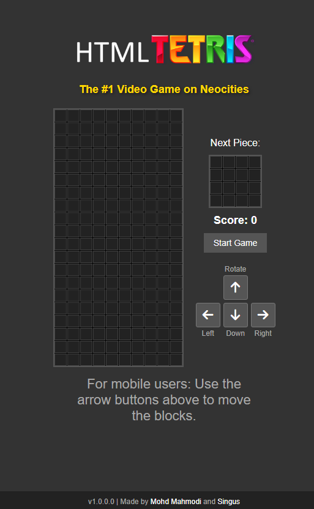

# 🕹️ Neocities Tetris Game


Welcome to the **#1 Video Game on Neocities**! This modern implementation of the classic Tetris game is built with HTML, CSS, and JavaScript, offering a responsive design for both desktop and mobile play.

## 🌟 Features

- 📱 Responsive design for seamless gameplay on any device
- 🎨 Colorful tetromino pieces
- 🔊 Background music to enhance your gaming experience
- 📊 Score tracking and level progression
- 🔄 Next piece preview
- ⌨️ Keyboard controls for desktop
- 👆 Touch controls for mobile devices

## 🖼️ Screenshots

<table>
  <tr>
    <td></td>
    <td></td>
  </tr>
  <tr>
    <td align="center"><i>Desktop Gameplay</i></td>
    <td align="center"><i>Mobile Gameplay</i></td>
  </tr>
</table>

## 🚀 Getting Started

### Prerequisites

- A modern web browser (Chrome, Firefox, Safari, or Edge)
- A web server (for local development)

### Installation

1. Clone the repository:
   ```
   git clone https://github.com/yourusername/neocities-tetris.git
   ```
2. Navigate to the project directory:
   ```
   cd neocities-tetris
   ```
3. Open `index.html` in your web browser or serve it using a local web server.

## 🎮 How to Play

- Use the arrow keys (desktop) or on-screen buttons (mobile) to control the tetrominos:
  - ⬅️ Left Arrow / Left Button: Move left
  - ➡️ Right Arrow / Right Button: Move right
  - ⬆️ Up Arrow / Rotate Button: Rotate piece
  - ⬇️ Down Arrow / Down Button: Move down faster
- Complete lines to score points and level up
- The game ends when the pieces stack up to the top of the grid

## 🧠 Code Structure

The game is built using vanilla JavaScript with a focus on modularity and readability. Here's an overview of the main components:

### HTML (`index.html`)

- Sets up the game's structure
- Includes the main grid, mini-grid for next piece preview, score display, and control buttons

### CSS (`style.css`)

- Defines the game's appearance
- Uses flexbox for responsive layout
- Implements a dark theme for better visibility

### JavaScript (`script.js`)

- **Game Initialization**: Sets up the game grid and variables
- **Tetromino Management**: Handles piece movement, rotation, and collision detection
- **Game Loop**: Controls the flow of the game, including piece spawning and line clearing
- **Scoring System**: Tracks score, levels, and increases game speed
- **Input Handling**: Manages both keyboard and touch inputs
- **Mobile Optimizations**: Prevents unwanted zooming and scrolling on mobile devices

## 🛠️ Technical Highlights

1. **Responsive Design**: Adapts to different screen sizes using CSS flexbox and media queries.
2. **Modular Code**: Functions are organized by their responsibilities, making the code easy to understand and maintain.
3. **Cross-Platform Compatibility**: Works on both desktop and mobile browsers.
4. **Performance Optimization**: Uses efficient algorithms for collision detection and line clearing.

## 🤝 Contributing

Contributions are welcome! Please feel free to submit a Pull Request.

## 📜 License

This project is licensed under the MIT License - see the [LICENSE.md](LICENSE.md) file for details.

## 👏 Acknowledgments

- Original Tetris game created by Alexey Pajitnov
- Inspiration from various JavaScript Tetris implementations
- Audio track: [Insert audio track credit here]

## 🧑‍💻 Authors

- [Mohd Mahmodi](https://github.com/MohdYahyaMahmodi/)
- [Singus](https://github.com/singus)

---

<p align="center">
  Made with ❤️ and JavaScript
</p>

